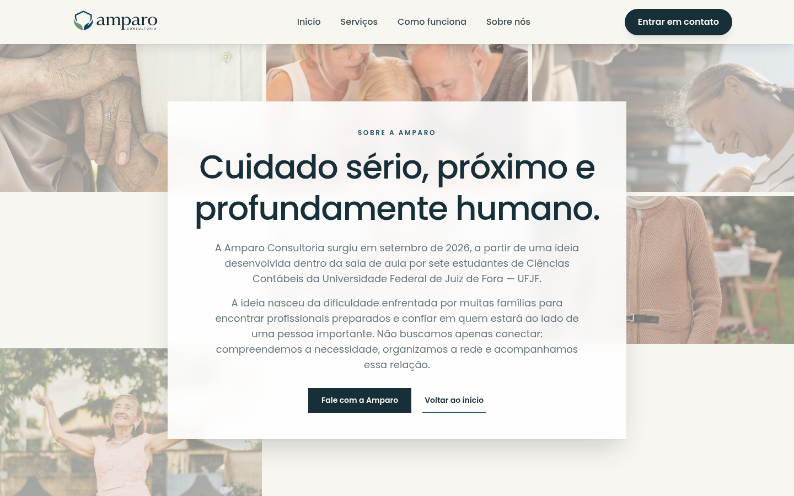

# Amparo Consultoria

Responsive website for Amparo Consultoria, a consultancy that helps families organize personalized care for older adults. The site presents its professional care network, explains the assessment and coordination process, and lets visitors start a conversation through WhatsApp.

This documentation is in English. The website content and navigation are in Brazilian Portuguese.

## Screenshots

Captured from the local production build on September 4, 2026. Desktop captures use a 1440 × 900 viewport; the mobile capture uses 390 × 844. These are viewport screenshots, not full-page captures.

### Home


### Services


### How it works


### About



### Contact


### Mobile


## Features and pages

| URL | Content |
| --- | --- |
| `/` | Three-slide hero carousel, contact form, and footer. |
| `/servicos` | Personalized care services and the multidisciplinary professional network. |
| `/como-funciona` | The process from family assessment to ongoing coordination. |
| `/sobre-nos` | Company presentation and approach to care. |
| `/#contato` | Contact section on the home page. |

Unrecognized paths redirect to the home page. The interface includes responsive navigation, carousel controls with pause/resume, and a contact form with required fields and consent.

## Technology

- React 19 and TypeScript 6.
- Vite 8 with the React plugin.
- Tailwind CSS 4, custom theme tokens, and locally bundled Poppins fonts.
- React Router for client-side routing.
- React Aria Components for interface primitives.
- Embla Carousel for the hero carousel.
- Oxlint for static analysis.

## Run locally

Use Node.js 20.19+ within the 20.x release line, or Node.js 22.12+, and npm. The project was verified with Node.js 22.14.0.

```sh
npm ci
npm run dev
```

Open the local URL printed by Vite.

### Configure WhatsApp

Create a `.env.local` file in the project root:

```dotenv
VITE_WHATSAPP_NUMBER=5511999999999
```

Replace the example with the actual service number, including country and area codes. Restart the development server after changing it. For production, set the variable in the deployment environment before building.

The contact form collects a name, phone number, email address, message, and required consent. Submission opens WhatsApp with a prefilled message; the visitor completes sending it there. This repository does not include a backend or database for contact submissions. If the number is missing, the form displays a configuration alert instead of opening WhatsApp.

Vite embeds `VITE_` variables in the client bundle, so they must not contain secrets.

## Commands

| Command | Purpose |
| --- | --- |
| `npm run dev` | Start the development server with hot reload. |
| `npm run build` | Type-check the application and create the production build in `dist/`. |
| `npm run preview` | Serve the production build locally after building. |
| `npm run lint` | Run Oxlint. |

## Project structure

```text
src/
  App.tsx             Route definitions and home page composition
  main.tsx            Application entry point
  components/         Header, footer, carousel, and shared UI components
  pages/              Page content and reusable detail layouts
  styles/theme.css    Theme tokens
  index.css           Global styles
  utils/              Shared utilities
public/
  images/             Brand assets and photography
  favicon.svg         SVG favicon
  favicon.png         PNG favicon
docs/screenshots/     Current desktop and mobile screenshots
vercel.json           SPA routing fallback for Vercel
```

The `@/` import alias resolves to `src/`. Route content is defined in `src/App.tsx` and `src/pages/`; hero slides are defined in `src/components/carousel.tsx`.

## Deployment

Run `npm run build` and publish `dist/` using a static host. On Vercel, use the Vite framework preset, the build command `npm run build`, and the output directory `dist`. The included `vercel.json` rewrites requests to `index.html` so direct visits to client-side routes work.

For other hosts, configure an equivalent SPA fallback. Set `VITE_WHATSAPP_NUMBER` before building and rebuild when it changes.

## Refresh the screenshots

1. Run `npm run build`, then `npm run preview`.
2. Open the preview URL in Chrome and wait for images and fonts to load.
3. Capture `/`, `/servicos`, `/como-funciona`, `/sobre-nos`, and `/#contato` at 1440 × 900; capture `/` at 390 × 844.
4. Capture the home page with its first slide visible. Use the same filenames under `docs/screenshots/` and update the capture date above.
